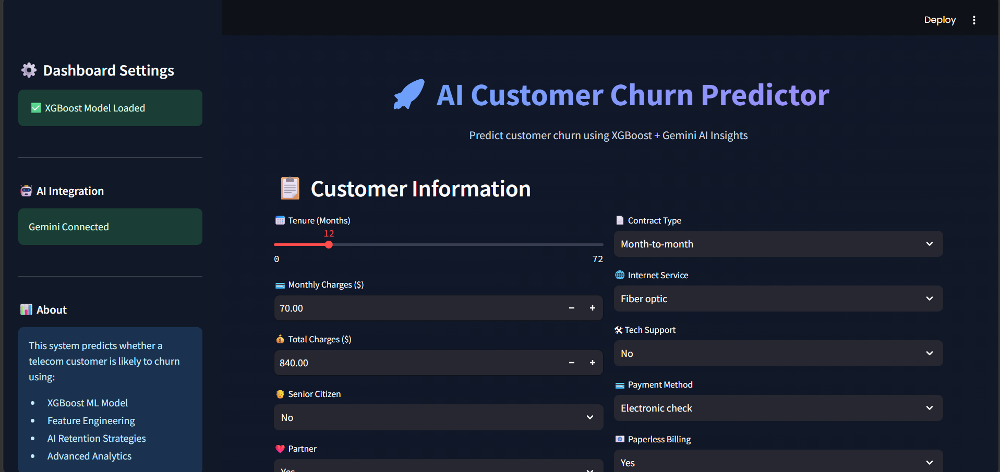
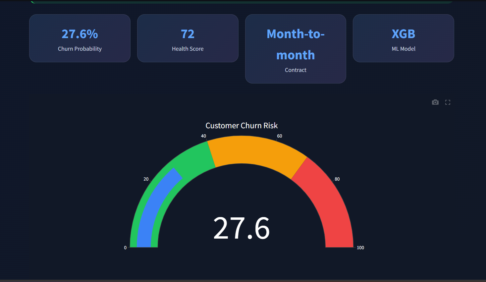
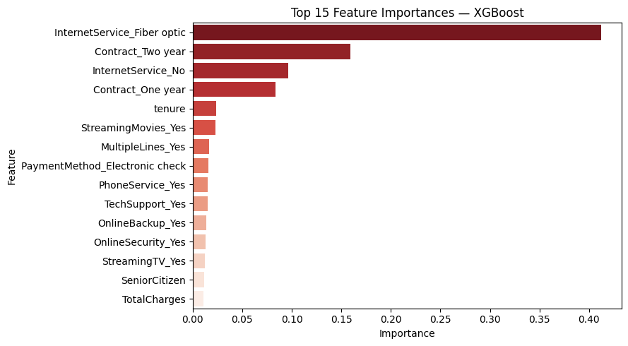
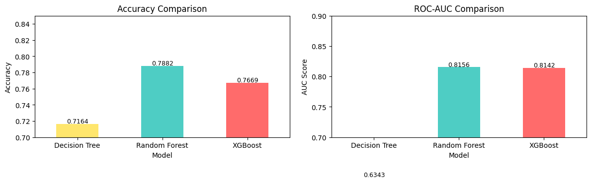
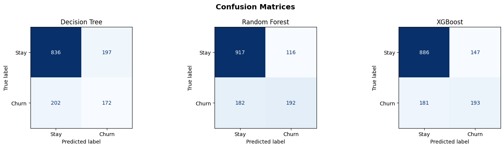
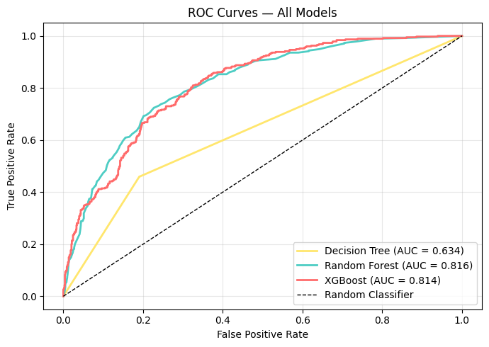

# 🚀 AI Customer Churn Prediction System

<div align="center">


### 🔮 Predict telecom customer churn using Machine Learning + Generative AI

</div>

---

# 📌 Overview

This project is an **AI-powered Customer Churn Prediction System** built using:

- ⚡ **XGBoost Classifier**
- 🎨 **Modern Streamlit Dashboard**
- 🤖 **Gemini AI Retention Insights**
- 📊 **Interactive Analytics & Risk Visualizations**

The system predicts whether a telecom customer is likely to **leave (churn)** or **stay**, then generates intelligent retention strategies using Google Gemini AI.

---

# ✨ Features

## 🤖 Machine Learning

- XGBoost-based churn prediction
- Feature engineering pipeline
- One-hot encoding + scaling
- Probability-based risk prediction

## 🎨 Modern UI/UX

- Dark futuristic dashboard
- Glassmorphism design
- Interactive charts & gauges
- Animated metric cards
- Responsive Streamlit layout

## 📊 Analytics

- Churn probability score
- Customer health score
- Risk gauge visualization
- Feature impact analysis

## 🧠 Gemini AI Integration

- Personalized retention strategies
- Upselling opportunities
- Executive AI summaries

## 📥 Export Features

- Downloadable prediction reports
- Runtime prediction summaries

---

# 🖼️ Application Preview

## 🔮 Main Dashboard

Modern AI-powered Streamlit interface with real-time predictions, customer health metrics, and churn probability scores.



---

## 📊 Churn Risk Gauge

Interactive gauge visualization showing the predicted customer churn risk on a scale from 0-100.



---

## 🤖 Gemini AI Insights

AI-generated personalized retention strategies and recommendations (shown as part of the dashboard view).


---

## 📈 Feature Importance Analysis

Top 15 features ranked by their importance in predicting customer churn using XGBoost.



---

# 📊 Model Performance & Evaluation

## Model Comparison — Accuracy & ROC-AUC

Comparative analysis of three ML models (Decision Tree, Random Forest, XGBoost) showing accuracy and ROC-AUC scores:

- **Decision Tree**: 71.64% accuracy, 0.6343 AUC
- **Random Forest**: 78.82% accuracy, 0.8156 AUC
- **XGBoost**: 76.69% accuracy, 0.8142 AUC ⭐ _Selected_



---

## 🎯 Confusion Matrices

Detailed prediction breakdown for all three models:



---

## 📈 ROC Curves

ROC curve comparison showing model discrimination ability:



---

# 📸 All Screenshots

Project screenshots and analytics visualizations:

| Screenshot           | Description                                       |
| -------------------- | ------------------------------------------------- |
| `assets/output5.png` | Main Streamlit dashboard with customer input form |
| `assets/output6.png` | Churn risk gauge visualization (0-100 scale)      |
| `assets/output5.png` | AI retention suggestions (part of dashboard)      |
| `assets/output.png`  | Top 15 XGBoost feature importance chart           |
| `assets/output4.png` | Accuracy & ROC-AUC comparison bar charts          |
| `assets/output3.png` | Confusion matrices for all three models           |
| `assets/output2.png` | ROC curve comparison for model evaluation         |

---

# 🧠 How It Works

## Step 1 — User Inputs Customer Data

The user enters:

- Tenure
- Monthly charges
- Contract type
- Internet service
- Tech support
- Payment method
- Billing preferences
- etc.

---

## Step 2 — Data Preprocessing

The app:

- Applies one-hot encoding
- Aligns features with training columns
- Scales numerical data using the saved scaler

---

## Step 3 — ML Prediction

The trained **XGBoost model** predicts:

- Churn probability
- Final churn verdict

---

## Step 4 — AI Retention Insights

If Gemini API is enabled:

- AI generates retention strategies
- Suggests upselling opportunities
- Creates executive summaries

---

# 📂 Dataset

### 📌 Telco Customer Churn Dataset

Source: Kaggle

Dataset File:

```text
WA_Fn-UseC_-Telco-Customer-Churn.csv
```

### 🎯 Target Variable

```text
Churn
```

Values:

- Yes
- No

---

# 🏗️ Tech Stack

| Technology   | Purpose            |
| ------------ | ------------------ |
| Python       | Backend            |
| Streamlit    | Web App            |
| XGBoost      | Machine Learning   |
| Scikit-learn | Preprocessing      |
| Plotly       | Interactive Charts |
| Pandas       | Data Handling      |
| Gemini AI    | AI Insights        |
| Matplotlib   | Visualizations     |

---

# 📁 Project Structure

```text
.
├── app.py
├── churn_model.ipynb
├── requirements.txt
├── README.md
├── DEPLOYMENT_GUIDE.md
├── model.pkl
├── scaler.pkl
├── features.pkl
├── assets/
│   ├── dashboard.png
│   ├── risk_gauge.png
│   ├── ai_insights.png
│   └── analytics.png
├── .streamlit/
│   └── secrets.toml
└── WA_Fn-UseC_-Telco-Customer-Churn.csv
```

---

# ⚙️ Installation

## 1️⃣ Clone Repository

```bash
git clone https://github.com/your-username/customer-churn-prediction.git
cd customer-churn-prediction
```

---

## 2️⃣ Install Dependencies

```bash
pip install -r requirements.txt
```

---

# 🔑 Gemini API Setup (Optional)

To enable AI retention insights:

## Option 1 — Environment Variable

### Windows

```bash
set GEMINI_API_KEY=your_api_key
```

### Linux / Mac

```bash
export GEMINI_API_KEY=your_api_key
```

---

## Option 2 — Streamlit Secrets

Create:

```text
.streamlit/secrets.toml
```

Add:

```toml
GEMINI_API_KEY = "your_api_key"
```

---

# ▶️ Run The Application

```bash
streamlit run app.py
```

---

# 📊 Model Training Pipeline

The notebook:

- Cleans data
- Encodes categorical variables
- Scales features
- Trains XGBoost model
- Evaluates performance
- Exports artifacts

Generated files:

```text
model.pkl
scaler.pkl
features.pkl
```

---

# 📈 Model Evaluation

The notebook includes:

- Accuracy Score
- Confusion Matrix
- ROC Curve
- Classification Report

---

# 🧪 Example Prediction

| Feature         | Value          |
| --------------- | -------------- |
| Tenure          | 12 Months      |
| Monthly Charges | $70            |
| Contract        | Month-to-Month |
| Tech Support    | No             |

### Prediction:

```text
🚨 HIGH CHURN RISK
Probability: 82%
```

---

# 📥 Generated AI Insights

Example:

```text
1. Offer a discounted annual contract upgrade.
2. Provide free premium tech support for 3 months.
3. Bundle streaming services to increase engagement.
```

---

# 🚀 Future Improvements

- 🔥 SHAP Explainability
- 📱 Mobile Responsive Enhancements
- ☁️ Cloud Deployment
- 📊 Real-time Monitoring Dashboard
- 🧠 Multi-model Ensemble
- 📡 Database Integration
- 🔐 User Authentication

---

# 🌐 Deployment Options

You can deploy this project on:

- Streamlit Cloud
- Render
- Railway
- AWS
- Azure
- Hugging Face Spaces

---

# 👨‍💻 Author

## Mohammad Bilal

Software Engineering Student  
AI + Full Stack Developer

---

# 📜 License

This project is licensed under the MIT License.

---

# ⭐ Support

If you liked this project:

- ⭐ Star the repository
- 🍴 Fork the project
- 🧠 Contribute improvements

---

<div align="center">

# 💙 Built with Streamlit + XGBoost + Gemini AI

</div>
